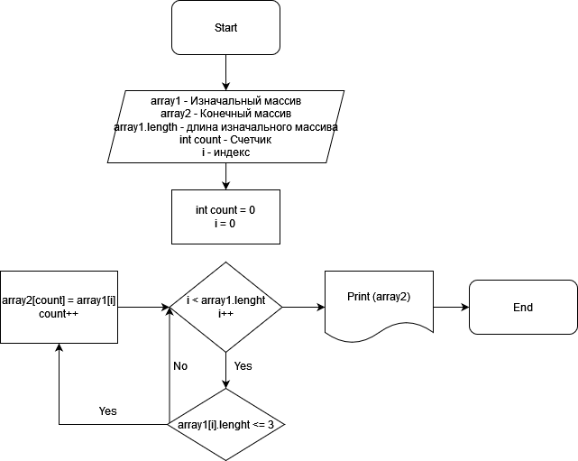

**Описание решения**
*Задача:*
*Написать программу, которая из имеющегося массива строк формирует массив из строк, длина которых меньше либо равна 3 символа. Первоначальный массив можно ввести с клавиатуры, либо задать на старте выполнения алгоритма. При решение не рекомендуется пользоваться коллекциями, лучше обойтись исключительно массивами*

**Описание алгоритма решения:**
1. Задаются всевозможные уточняющие вопросы заказчику проекта.
2. Разрабатывается алгоритм решения задачи.
3. Разрабатывается блок-схема:

4. Пишется программа:
  * сначала объявляется два массива: изначальный и конечный такой же длины; 
  * потом метод, в котором цикл соразмерный длине массива;
  * внутри цикла проводится проверка условия ( <=3 ): если условие выполняется, то элемент первого массива заносится в count-элемент второго массива(переменная count нужна для того, чтобы поочередно закидывать из первого массива во второй и чтобы потом не было пробелов);
   * далее переменная count увеличивается на 1 и возвращается к циклу for, в котором i увеличивается на 1;
   * проверка проводится до тех пор, пока условие не перестанет выполняться.
5. Проводится проверка работоспособности программы.